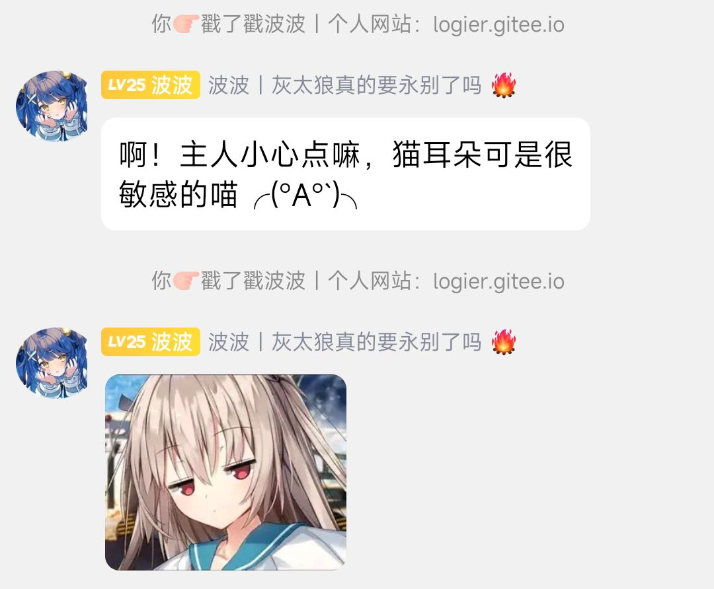
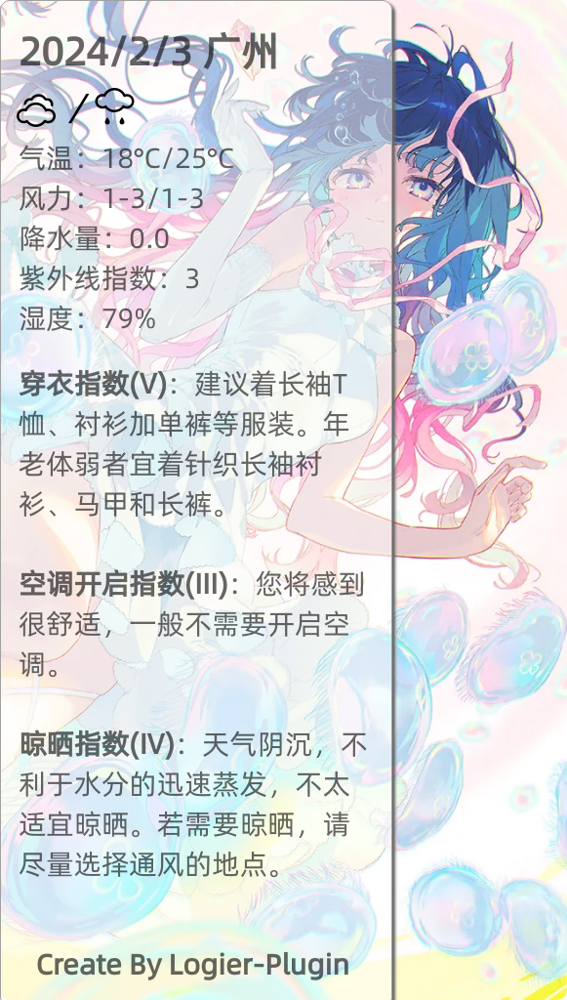
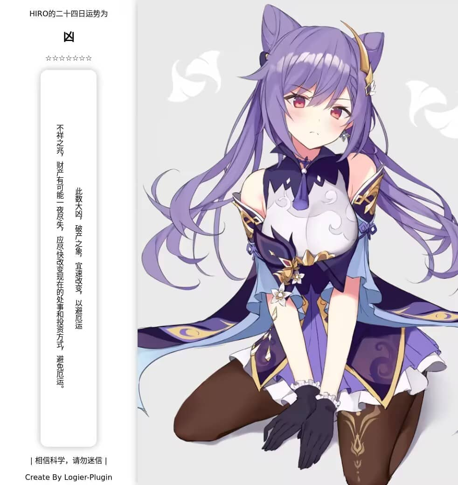
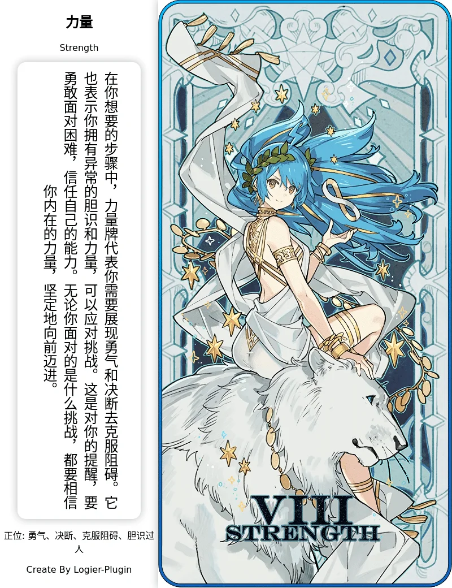
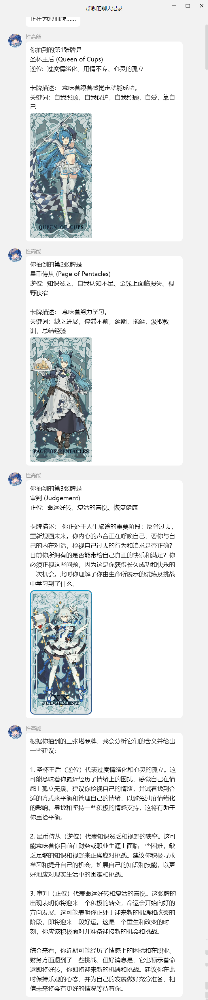
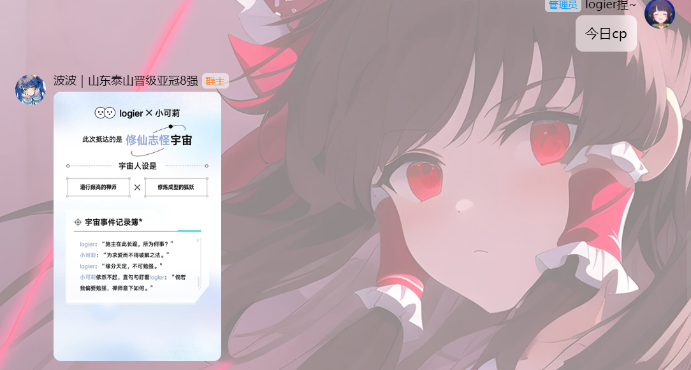
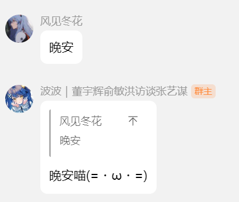
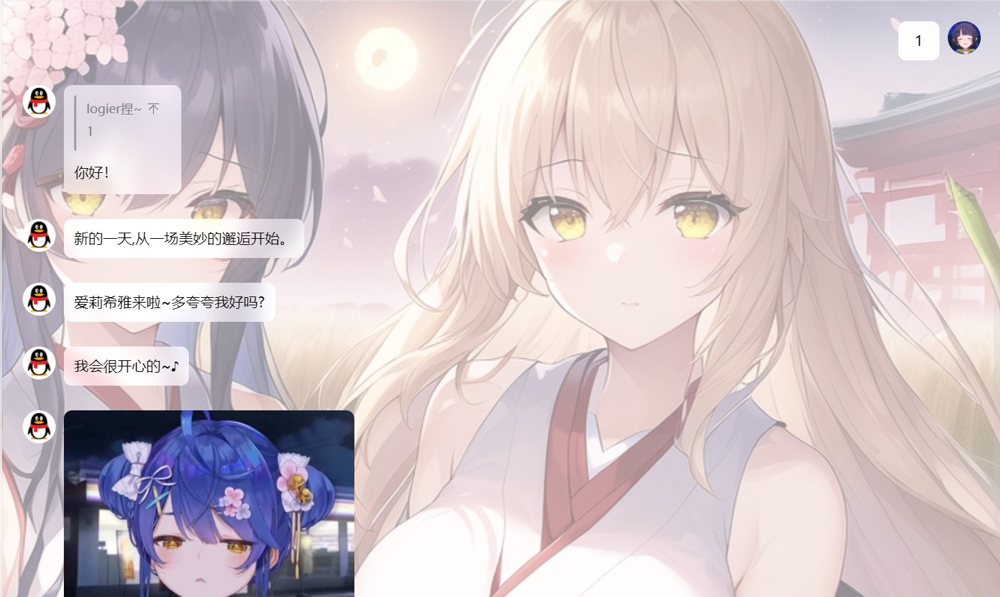
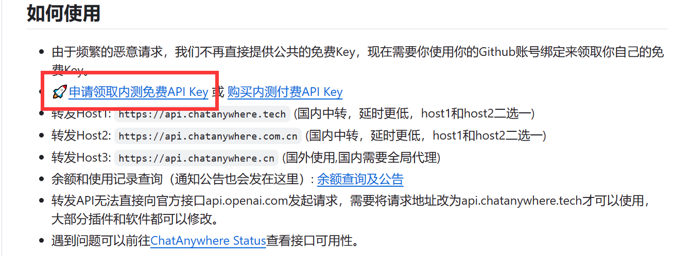

# 鸢尾花插件(logier-plugin) 分支版
<div align="center">
  <a href="https://logier.gitee.io/">
    
  </a>
<br>

 [](https://qm.qq.com/cgi-bin/qm/qr?k=Tx0KJBxwamQ1slXC4d3ZVhSigQ9MiCmJ&jump_from=webapi&authKey=BJVVNjuciQCnetGahh3pNOirLULs1XA7fQMn/LlPWAWk5GDdr2WWB/zHim1k1OoY) &nbsp; [](https://logier.gitee.io/) &nbsp;(https://gitee.com/logier/emojihub/) &nbsp; <a href='https://gitee.com/logier/logier-plugins/stargazers'></img></a> &nbsp; 

 
</div>
<br>


 

***如果发现bug，希望及时Q群告知我或提交issue***
***如果喜欢本插件，就点点star吧***

## 更新日志 💡

### **24.08.16 修复大量BUG `VS 语法懂的不是很多 可能会出现屎山`**
### **24.02.26 更新潜伏模板，群聊中收到消息后概率GPT回复并发送表情包，对俗手哥拙劣的模仿**
### **24.02.23 破坏性更新，修复了更新后配置项丢失的问题，以及启动插件缺失yaml文件的问题，更新后需要重新配置，谨慎更新**

## 安装教程 ✨


Yunzai-Bot目录下执行

gitee
```
git clone --depth=1 https://gitee.com/cnxiaodoubi/logier-plugins ./plugins/logier-plugin/
```


## 插件功能 👓

- 发送 **#鸢尾花帮助** 获取插件详细信息

- 推荐使用[锅巴插件](https://gitee.com/guoba-yunzai/guoba-plugin)进行配置

<br>


| 名称 | 指令 | 名称 | 指令 |
|-------|------ |-------|------ |
| 表情包仓库 | #表情包 | 表情包小偷 | 发送消息随机触发 |
| 戳一戳表情 | 戳一戳触发 | 保存表情包 | #存(表情\|涩图) <br> #查看(表情包\|涩图)+序号？<br> #删除(表情包\|涩图)+序号  | 
| 定时发图 | 定时推送 | 摸鱼日历 | 定时推送 | 
| 今日新闻 | 定时推送 | 城市天气 | 定时推送 |  
| 今日运势 | #今日运势 #悔签 | cp生成器 | #今日cp | 
| 算一卦 | #算卦 #悔卦 | 塔罗牌 | #塔罗牌 #占卜 #彩虹塔罗牌 | 
| 签到 | #签到 | 番剧 | #今日番剧 |
| 自定义图片api | 自定义指令 | 进退群通知 | 进退群触发 | 
| 问候回复 |  打招呼触发 <br> 例如早安、晚安 | 订阅小说 | #搜小说+轻小说书名 <br> #订阅小说+轻小说书名 <br> #查看订阅小说 |
| 潜伏模板 |  发送消息随机触发 |  |  |
<br>

### 表情包系列

<details> <summary>表情包仓库</summary>

- 可联动**保存表情包**，将保存地址填入自定义表情包地址。
- [表情包仓库源地址](https://gitee.com/logier/emojihub)
- 最新版更新锅巴配置屏蔽部分表情包，如龙图、小黑子，支持分群配置。
- 可配置表情包仓库随机时自定义表情包概率，默认为0

| 指令 | 表情包 | 指令 | 表情包 |
| :----:| :----: | :----:| :----: |
| 表情包仓库 | 全随机 | 自定义表情包 | 自定义表情包 |
| 阿夸 |  | 阿尼亚 |  |
| 白圣女 |  | 柴郡 |  |
| 甘城猫猫 |  | 狗妈 |  |
| chiikawa |  | 龙图 |  |
| capoo |  | 小黑子 |  |
| 亚托莉 |  | 真寻 |  |
| 七濑胡桃 |  | 小狐狸 |  |
| 喵内 |  | 波奇 |  |
| 心海 |  |  |  |
</details>
<br>

<details> <summary>表情包小偷</summary>

- 配置群号，当群里有人发表情包时，会记录到数据库。
- 配置概率，当配置群里有人发消息时，会概率把之前记录的表情包发送。
</details>
<br>

<details> <summary>戳一戳表情包</summary>

- 戳一戳发送表情包，配置和**表情包仓库**共用。
- 配置概率，默认为0，全部用表情包回复，提高会概率用GPT回复。
- GPT需要配置key，[如何获取key？](#如何获取key)


</details>
<br>

<details> <summary>保存表情包</summary>

- **保存+图片**或**引用图片+保存**即可保存。
- 默认保存路径云崽根目录+/resources/logier/emoji
- 支持保存多张。
- **查看表情包**会返回图片编号
- **查看表情包+编号**会发送此编号的图片
- **删除表情包+编号**会删除此编号的图片
- 支持双路径保存
</details>
<br>

### 定时系列

<details> <summary>定时发图、摸鱼日历、今日新闻</summary>

- [定时发图如何获取图片api？](#如何获取图片api)
- 配置发送时间，采用cron表达式。👉[Cron表达式在线生成器](https://cron.qqe2.com/)
</details>
<br>

<details> <summary>城市天气</summary>

- 配置发送时间，采用cron表达式。👉[Cron表达式在线生成器](https://cron.qqe2.com/)
- 使用和风天气API获得天气信息。[如何获取key？](#如何获取key)


</details>
<br>

<details> <summary>今日番剧</summary>


</details>
<br>

### 运势系列

<details> <summary>今日运势、算一卦</summary>

- [如何获取图片api](#如何获取图片api)




</details>

<br>


<details> <summary>塔罗牌</summary>

- 由AI解析占卜，需要gptkey [如何获取key？](#如何获取key)
- 发送塔罗牌+想占卜的东西即可



- 支持抽三张占卜，发送 占卜+想占卜的东西 即可。
- 注意！三牌占卜会用合并转发形式发送，部分适配器可能不支持。


</details>
<br>


<details> <summary>签到</summary>

- 请使用横图图源 [如何获取图片api？](#如何获取图片api)
- 竖图适配也许做，也许不做。


</details>
<br>

<details> <summary>今日老婆</summary>

- 重复发送marry会看到今天娶了谁。
- 使用图片形式发送，带有一句结婚祝词。
- 可以离婚（
- 离婚一天只能一次。


</details>
<br>

<details> <summary>今日cp</summary>

- 随机抽一个倒霉蛋群友组成cp
- 这个功能测试的时候快被群友昵称的特殊字符整疯了


</details>
<br>

### 小修系列

准备重新写小时系列代码
<details> <summary>进退群通知</summary>

- 修改自官方插件。
- 进群时会发送其头像和一句 俏皮话欢迎。
- 退群时有必要说俏皮话吗？


</details>
<br>

<details> <summary>问候回复</summary>

- 发送早安、中午好、晚上好等词回复。
- GPT回复，需要key，[如何获取key？](#如何获取key)


</details>
<br>


<details> <summary>潜伏模板</summary>


</details>
<br>


## 配置事项 📢

### 如何填入本地图库？
使用图片时，均可以使用本地或者网络图片
本地图片支持图片文件上级目录，也就是如果文件结构如下，可以填写emojihub或capoo-emoji
```
├── emojihub
│   ├── capoo-emoji
│   │   ├── capoo100.gif
│   ├── greyscale-emoji
│   │   ├── greyscale100.gif
支持jpg、jpeg、png、webp、gif
```
寻图逻辑获取文件夹和子文件夹下的所有图片然后随机一张

<br>

### 如何获取key？

- 塔罗牌、问候回复和戳一戳回复需要GPT，可以前往[chatanywhere](https://github.com/chatanywhere/GPT_API_free?tab=readme-ov-file#%E5%A6%82%E4%BD%95%E4%BD%BF%E7%94%A8)免费获得。

<details> <summary>还是不懂？</summary>

1.点击领取内测免费API Key



<br>

2.复制这一串东西填入


</details>
<br>


- 城市天气可以前往[和风天气](https://console.qweather.com/#/apps)免费获得，👉[和风天气官方教程](https://dev.qweather.com/docs/configuration/project-and-key/)
<br>
<br>

### 如何获取图片api

[我的个人博客](https://www.atxrom.com/)有很多我收集的图片api (不是logier的博客了)
<details> <summary>图片api预览</summary>

</details>
<br>


## 作者相关 🎲
- [QQ群](https://qm.qq.com/cgi-bin/qm/qr?k=Tx0KJBxwamQ1slXC4d3ZVhSigQ9MiCmJ&jump_from=webapi&authKey=BJVVNjuciQCnetGahh3pNOirLULs1XA7fQMn/LlPWAWk5GDdr2WWB/zHim1k1OoY)
- [个人博客网站](https://www.atxrom.com/)

<details> <summary>参考仓库列表</summary>

- [今日运势源仓库](https://github.com/twiyin0/koishi-plugin-jryspro)
- [云崽插件基础示例](https://gitee.com/Zyy955/Miao-Yunzai-plugin)
- [云崽市场](https://gitee.com/yhArcadia/Yunzai-Bot-plugins-indexn)
- [向日葵插件](https://gitee.com/xrk114514/xrk-plugin)
</details>

<details> <summary>赞助人列表</summary>

| 昵称 | 金额 |
| :----:| :----: |
| 悠修 | 10元 |
| 慕蝶 | 5元 |
| Hirasawa Yui | 5元 |
| EF-2000台风 | 50元 |

</details>